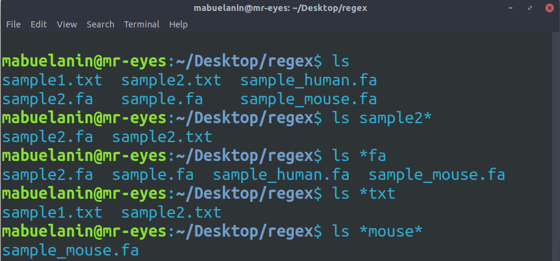

## What is regex?
A regular expression, or regex, in general, is a pattern of text you define that a Linux program like sed or awk uses to filter text or any software that supports regex usage.

We saw some of those patterns when introducing basic Linux commands and saw how the ls command uses wildcard characters to filter output.




## Types of Regex

There are many different applications that use different types of regex in Linux, like the regex included in programming languages (Java, Perl, Python, etc.) and Linux programs like (sed, awk, grep) and many other applications.

A regex pattern uses a regular expression engine which translates those patterns.

1. **Create mysampledata.txt file**

```bash
Fred apples 20
Susy oranges 5
Mark watermellons 12
Robert pears 4
Terry oranges 9
Lisa peaches 7
Susy oranges 12
Mark grapes 39
Anne mangoes 7
Greg pineapples 3
Oliver rockmellons 2
Betty limes 14
```

2. **Get every line contains the word** **mellion**

```bash
grep 'mellon' mysampledata.txt
```

3. **Sometimes we want to know not only which lines matched but their line number as well.**

```bash
grep -n 'mellon' mysampledata.txt
```

4. **Or maybe we are not interested in seeing the matched lines but wish to know how many lines did match.**

```bash
grep -c 'mellon' mysampledata.txt
```

**Regular Expression Overview**

- '.' (dot) - a single character.
- '?' the preceding character matches 0 or 1 times only.
- '*' the preceding character matches 0 or more times.
- '+' the preceding character matches 1 or more times.
- {n} - the preceding character matches exactly n times.
- {n,m} - the preceding character matches at least n times and not more than m times.
- [agd] - the character is one of those included within the square brackets.
- [^agd] - the character is not one of those included within the square brackets.
- [c-f] - the dash within the square brackets operates as a range. In this case it means either the letters c, d, e or f.
- () - allows us to group several characters to behave as one.
- | (pipe symbol) - the logical OR operation.
- ^ - matches the beginning of the line.
- $ - matches the end of the line.


## **Examples**

**Identify any line with two or more vowels in a row.**

```bash
grep -E '[aeiou]{2,}' mysampledata.txt
```

**Any line with a 2 on it which is not the end of the line,In this example the multiplier + applies to the "." which is any character**

```bash
grep -E '2.+' mysampledata.txt
```

**The number 2 as the last character on the line.**

```bash
grep -E '2$' mysampledata.txt
```

**And now each line which contains either 'is' or 'go' or 'or'.**

```bash
grep -E 'or|is|go' mysampledata.txt
```

**Orders for everyone who's name begins with A - K.**

```bash
grep -E '^[A-K]' mysampledata.txt
```


